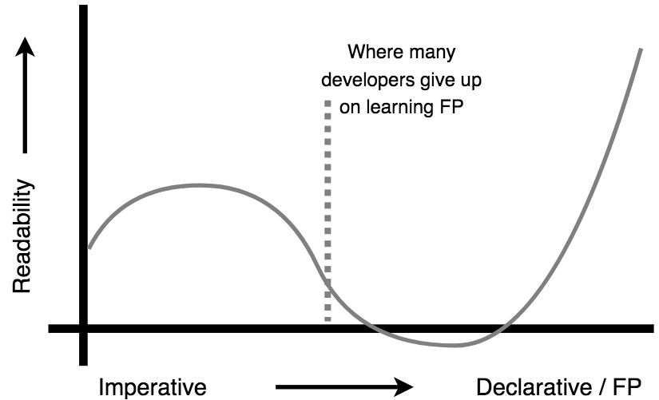

# Functional-Light JavaScript
# Capítulo 11: Aplicando tudo junto

Por agora, você tem tudo o que precisa para entender o Functional-Light JavaScript. Não há mais novos conceitos para introduzir.

Neste capítulo final, nosso objetivo principal será a coesão conceitual. Nós iremos olhar o código que trás muitos do principais temas deste livro -- aplicando tudo o que nós aprendemos. Acima de tudo, esse código de exemplo é destinado a ilustrar o "Functional Light" para o JavaScript -- que é, equilíbrio e pragmatismo sobre dogma.

Primeiro vamos praticar essas técnicas por você mesmo, extensamente. Digerindo esse capítulo é fundamental ajudar você aplicar princípios de FP em seu código real.

## Configuração

Vamos construir um simples widget de cotação da bolsa.

**NOTA:** Para referência, o código inteiro deste código de exemplo está no sub-diretório `ch11-code/` -- veja o repositório do [livro no GitHub](https://github.com/getify/Functional-Light-JS). Além disso, os utilitários de FP que discutimos através deste livro que nós precisaremos estarão incluídos no `ch11-code/fp-helpers.js`. Neste capítulo nós iremos apenas focar na parte relevante do código para nossa discussão.

Primeiro, vamos falar sobre a marcação deste widget, então nós teremos onde exibir nossa informação. Nós começaremos com um elemento `<ul ..>` vazio no nosso arquivo `ch11-code/index.html`, mas quando rodado, o DOM irá mudar para algo parecido com isso:

```html
<ul id="stock-ticker">
    <li class="stock" data-stock-id="AAPL">
        <span class="stock-name">AAPL</span>
        <span class="stock-price">$121.95</span>
        <span class="stock-change">+0.01</span>
    </li>
    <li class="stock" data-stock-id="MSFT">
        <span class="stock-name">MSFT</span>
        <span class="stock-price">$65.78</span>
        <span class="stock-change">+1.51</span>
    </li>
    <li class="stock" data-stock-id="GOOG">
        <span class="stock-name">GOOG</span>
        <span class="stock-price">$821.31</span>
        <span class="stock-change">-8.84</span>
    </li>
</ul>
```

Antes de irmos adiante, deixe-me te lembrar: interagir com o DOm é I/O, e isso significa efeitos colaterais. Nós não podemos eliminar estes efeitos colaterais, mas podemos limitar e controlá-los. Nós queremos ser realmente intencionais sobre minimizar a área de superfície da nossa aplicação que lida com o DOM. Nós aprendemos todas estas técnicas em [Capítulo 5](ch5.md).

Resumindo a funcionalidade do nosso widget: o código irá adicionar os elementos `<li ..>` cada vez que um novo evento nova-bolsa é "recebido", e irá atualizar e mudar o preço com os eventos de atualizacao-bolsa que chegam.

Neste código de exemplo do Capítulo 11, no `ch11-code/mock-server.js`, nós agora colocamos alguns temporizadores para empurrar fora alguns dados falsos de data da bolsa para um simples emissor de evento, para simular  como se nós estivéssemos recebendo mensagens de dados da bolsa de um servidor. Nós expusemos uma função `conectarComServidor()` que que parece fazer isso, mas realmente apenas retorna um evento falso da instância do emissor.

**Nota:** Neste arquivo todo este ambiente falso/simulado, então eu não irei gastar muito esforço tentando fazê-lo muito aderente ao princípio de FP. Eu não sugiro gastar muito tempo preocupado com o código neste arquivo. Se você escreveu um servidor real -- um exercício extra de crédito muito interessante para um leitor ambicioso! -- você

No arquivo `ch11-code/stock-ticker-events.js`, criamos alguns observables (via RxJS) conectados a um objeto de emissor de eventos. Chamamos o método `connectToServer()` para obter este objeto de emissor, depois escutamos os nomes de evento `"stock"` (adicionando uma nova bolsa ao nosso ticker) e `"stock-update"` (atualizando a listagem de preço e mudança da bolsa). Finalmente, definimos transformações nos dados recebidos por estes observables, formatando os dados conforme necessário.

No arquivo `ch11-code/stock-ticker.js`, definimos nossa comportamento de UI (efeitos colaterais do DOM) como métodos no objeto `stockTickerUI`. Também definimos uma variedade de helpers, incluindo `getElemAttr(..)`, `stripPrefix(..)`, e outros. Por fim, estamos `subscribe(..)` aos dois observables que nos fornecem dados formatados para renderizar no DOM.

## Eventos de Bolsa

Vamos olhar o código em `ch11-code/stock-ticker-events.js`. Vamos começar com alguns helpers básicos:

```js
function addStockName(stock) {
    return setProp( "name", stock, stock.id );
}
function formatSign(val) {
    if (Number(val) > 0) {
        return `+${val}`;
    }
    return val;
}
function formatCurrency(val) {
    return `$${val}`;
}
```

Essas funções puras devem ser interpretadas como bem fáceis. Recupere [`setProp(..)` do Capítulo 4](ch4.md/#user-content-setprop) que realmente clona o objeto antes de definir a nova propriedade. Esse exercício exerce o princípio que vimos no Capítulo 6: evitar efeitos colaterais através da tratamento de valores como imutáveis, mesmo que não sejam.

`addStockName(..)` é usado para adicionar uma propriedade `name` a um objeto de mensagem de bolsa que é igual a seu `id`. O valor `name` é usado posteriormente como o nome de bolsa visível no widget.

Quando uma mensagem de bolsa é recebida do "server", ela vai ter o formato:

```js
{ id: "AAPL", price: 121.7, change: 0.01 }
```

Antes de ser exibido no DOM, o `price` precisa ser formatado com `formatCurrency(..)` (para ficar como `"$121.70"`), e o `change` precisa ser formatado com `formatChange(..)` (para ficar como `"+0.01"`). Mas não queremos modificar o objeto de mensagem, então precisamos de uma função auxiliar que formate os números e nos dá um novo objeto de bolsa:

```js
function formatStockNumbers(stock) {
    var stockDataUpdates = [
        [ "price", formatPrice( stock.price ) ],
        [ "change", formatChange( stock.change ) ]
    ];

    return reduce( function formatter(stock,[propName,val]){
        return setProp( propName, stock, val );
    } )
    ( stock )
    ( stockDataUpdates );
}
```

Criamos o `stockDataUpdates` array para armazenar tuplas (apenas arrays) de nome de propriedade e valor formatado, para `price` e `change` respectivamente. Vamos `reduce(..)` (veja [Capítulo 9](ch9.md/#reduce)) sobre essa lista, com o objeto `stock` como o `initialValue`. Desestruturamos a tupla em `propName` e `val`, e então retornamos a chamada `setProp(..)`, que retorna um novo objeto clonado com a propriedade definida.

Agora vamos definir mais alguns helpers:

```js
var formatDecimal = unboundMethod( "toFixed" )( 2 );
var formatPrice = pipe( formatDecimal, formatCurrency );
var formatChange = pipe( formatDecimal, formatSign );
var processNewStock = pipe( addStockName, formatStockNumbers );
```

A função `formatDecimal(..)` recebe um número (como `2.1`) e chama o seu método `toFixed( 2 )`. Usamos o [Capítulo 9's `unboundMethod(..)`](ch9.md/#adapting-methods-to-standalones) para criar um método late-bound standalone.

`formatPrice(..)`, `formatChange(..)`, e `processNewStock(..)` são todas composições com `pipe(..)`, cada composição de uma série de operações de esquerda para direita (veja [Capítulo 4](ch4.md)).

Para criar nossas observables (veja [Capítulo 10](ch10.md/#observables)) a partir do nosso emissor de eventos, vamos querer uma função auxiliar que seja uma curried (veja [Capítulo 3](ch3.md/#one-at-a-time)) standalone do `Rx.Observable.fromEvent(..)` do RxJS:

```js
var makeObservableFromEvent =
    curry( Rx.Observable.fromEvent, 2 )( server );
```

Essa função é especificada para ouvir o `server` (emissor de eventos), e está esperando que uma string de nome de evento produza sua observable. Temos todos os pedaços prontos para criar observadores para nossos dois eventos, e para mapear-transformar esses observadores para formatar os dados recebidos:

```js
var observableMapperFns = [ processNewStock, formatStockNumbers ];

var stockEventNames = [ "stock", "stock-update" ];

var [ newStocks, stockUpdates ] = pipe(
    map( makeObservableFromEvent ),
    curry( zip )( observableMapperFns ),
    map( spreadArgs( mapObservable ) )
)
( stockEventNames );
```

Nós começamos com `stockEventNames`, uma lista de nomes de evento (`["stock","stock-update"]`), então `map(..)` (veja [Capítulo 9](ch9.md/#map)) para uma lista de dois observables, e `zip(..)` (veja [Capítulo 9](ch9.md/#zip)) para uma lista de funções de mapeamento de observables, produzindo uma lista de tuplas como `[ observable, mapperFn ]`. Por fim, mapeamos essas tuplas com `mapObservable(..)`, espalhando cada tuplo como argumentos individuais usando `spreadArgs(..)` (veja [Capítulo 3](ch3.md/#user-content-spreadargs)).

O resultado final é uma lista de dois observables mapeados, que podemos array-destructurar para atribuições para `newStocks` e `stockUpdates`, respectivamente.

Isso é tudo; é a nossa abordagem FP-Light para configurar nossos observables de eventos do ticker de bolsa! Vamos se inscrever nesses dois observables em `ch11-code/stock-ticker.js`.

Tente uma etapa de volta e refletir sobre nosso uso de princípios de FP aqui. Foi isso que fizer? Você pode ver como aplicamos vários conceitos cobertos nas capítulos anteriores deste livro? Você pensa em outras maneiras de completar essas tarefas?

Mais importante, como você teria feito isso imperativamente, e como você pensa nessas duas abordagens seriam comparadas, em geral? Tente esse exercício. Escreva o equivalente usando abordagens imperativas bem estabelecidas. Se você é como eu, a forma imperativa ainda se sentirá mais natural.

O que você precisa *obter* antes de continuar é que você também *também* entende e raziona sobre o estilo FP que acabamos de apresentar. Pense na forma (os inputs e output) de cada função e peça. Você vê como elas se encaixam?

Continue praticando até que essa coisa seja alcançável para você.

## Interface do Ticker de Bolsa

Se você sentiu-se confortável com o FP da última seção, você está pronto para explorar `ch11-code/stock-ticker.js`. É consideravelmente mais envolvido, então vamos levar nosso tempo para olhar cada pedaço em sua totalidade.

Vamos começar definindo alguns helpers que nos ajudarão nas tarefas de DOM:

```js
function isTextNode(node) {
    return node && node.nodeType == 3;
}
function getElemAttr(prop,elem) {
    return elem.getAttribute( prop );
}
function setElemAttr(elem,prop,val) {
    // !!EFEITOS COLATERAIS!!
    return elem.setAttribute( prop, val );
}
function matchingStockId(id,node){
    return getStockId( node ) == id;
}
function isStockInfoChildElem(elem) {
    return /\bstock-/i.test( getClassName( elem ) );
}
function appendDOMChild(parentNode,childNode) {
    // !!EFEITOS COLATERAIS!!
    parentNode.appendChild( childNode );
    return parentNode;
}
function setDOMContent(elem,html) {
    // !!EFEITOS COLATERAIS!!
    elem.innerHTML = html;
    return elem;
}

var createElement = document.createElement.bind( document );

var getElemAttrByName = curry( getElemAttr, 2 );
var getStockId = getElemAttrByName( "data-stock-id" );
var getClassName = getElemAttrByName( "class" );
var isMatchingStock = curry( matchingStockId, 2 );
```

Essas devem ser mais ou menos Autoexplicativos.

Observe que eu chamei os efeitos colaterais de modificar o estado de um elemento DOM. Nós não podemos clonar facilmente um objeto DOM e substituí-lo, então vamos aqui para um efeito colateral de alterar um existente. Pelo menos, se tivermos um bug no nosso renderizado DOM, podemos facilmente procurar por esses comentários de código para restringir em suspeitos prováveis.

Aqui estão outros helpers diversos:

```js
function stripPrefix(prefixRegex,val) {
    return val.replace( prefixRegex, "" );
}

function listify(listOrItem) {
    if (!Array.isArray( listOrItem )) {
        return [ listOrItem ];
    }
    return listOrItem;
}
```

Vamos definir um helper para obter os filhos de um elemento DOM:

```js
var getDOMChildren = pipe(
    listify,
    flatMap(
        pipe(
            curry( prop )( "childNodes" ),
            Array.from
        )
    )
);
```

Primeiro, usamos `listify(..)` para garantir que temos uma lista de elementos (mesmo que seja apenas um único item na sua comprimento). Recupere [`flatMap(..)` do Capítulo 9](ch9.md/#user-content-flatmap), que mapei uma lista e então aplana uma lista-de-listas em uma lista mais leve.

Nosso mapeamento aqui mapei de um elemento para sua lista `childNodes`, que fazemos em um array real (em vez de uma lista de nós vivos) com `Array.from(..)`. Essas duas funções são compostas (via `pipe(..)`) em uma única função de mapeamento, que é fusão (veja [Capítulo 9](ch9.md/#fusion)).

Agora, vamos usar este `getDOMChildren(..)` helper para definir utilitários para recuperar elementos DOM específicos no nosso widget:

```js
function getStockElem(tickerElem,stockId) {
    return pipe(
        getDOMChildren,
        filterOut( isTextNode ),
        filterIn( isMatchingStock( stockId ) )
    )
    ( tickerElem );
}
function getStockInfoChildElems(stockElem) {
    return pipe(
        getDOMChildren,
        filterOut( isTextNode ),
        filterIn( isStockInfoChildElem )
    )
    ( stockElem );
}
```

`getStockElem(..)` começa com o elemento DOM `tickerElem` para nosso widget, recupera seus elementos filho, e então filtra para garantir que temos o elemento correspondente ao identificador de bolsa especificado. `getStockInfoChildElems(..)` faz quase a mesma coisa, exceto que começa com um elemento de bolsa, e restringe com diferentes filtros.

Ambas as utilitárias filtram nós de nós de texto (pois eles não funcionam da mesma forma que nós vivos), e ambas as utilitárias retornam uma lista de elementos DOM, mesmo que seja apenas um único elemento.

### API Principal

Vamos usar um objeto `stockTickerUI` para organizar nossas três métodos de UI principais de manipulação, como isso:

```js
var stockTickerUI = {

    updateStockElems(stockInfoChildElemList,data) {
        // ..
    },

    updateStock(tickerElem,data) {
        // ..
    },

    addStock(tickerElem,data) {
        // ..
    }
};
```

Vamos primeiro examinar `updateStock(..)`, pois é o mais simples dos três:

```js
updateStock(tickerElem,data) {
    var getStockElemFromId = curry( getStockElem )( tickerElem );
    var stockInfoChildElemList = pipe(
        getStockElemFromId,
        getStockInfoChildElems
    )
    ( data.id );

    return stockTickerUI.updateStockElems(
        stockInfoChildElemList,
        data
    );
},
```

Aplicar Currying na função auxiliar `getStockElem(..)` com `tickerElem` nos dá `getStockElemFromId(..)`, que receberá `data.id`.

Via `pipe(..)`, o valor de retorno `getStockElemFromId(data.id)` é um elemento `<li>` (em realidade, uma lista contendo apenas esse elemento), que é passado para `getStockInfoChildElems(..)`.

O resultado é uma lista (`stockInfoChildElemList`) com os três elementos filho `<span>` para a informação de exibição do bolsa. Passamos essa lista e o objeto de mensagem `data` do bolsa junto para `stockTickerUI.updateStockElems(..)` para atualizar realmente esses três elementos `<span>` com os novos dados.

Agora vamos olhar como `stockTickerUI.updateStockElems(..)` é definido:

```js
updateStockElems(stockInfoChildElemList,data) {
    var getDataVal = curry( reverseArgs( prop ), 2 )( data );
    var extractInfoChildElemVal = pipe(
        getClassName,
        curry( stripPrefix )( /\bstock-/i ),
        getDataVal
    );
    var orderedDataVals =
        map( extractInfoChildElemVal )( stockInfoChildElemList );
    var elemsValsTuples =
        filterOut( function updateValueMissing([infoChildElem,val]){
            return val === undefined;
        } )
        ( zip( stockInfoChildElemList, orderedDataVals ) );

    // !!EFEITOS COLATERAIS!!
    compose( each, spreadArgs )
    ( setDOMContent )
    ( elemsValsTuples );
},
```

Isso é um pouco para se entender, eu sei. Mas vamos quebrar isso em passos.

`getDataVal(..)` está vinculado ao objeto de mensagem `data`, que foi curried após reversão de argumentos, então agora está esperando um nome de propriedade para extrair de `data`.

Em seguida, vamos olhar como `extractInfoChildElemVal(..)` é definido:

```js
var extractInfoChildElemVal = pipe(
    getClassName,
    curry( stripPrefix )( /\bstock-/i ),
    getDataVal
);
```

Essa função recebe um elemento DOM, recupera seu DOM class, remove o prefixo `"stock-"` desse valor, e então usa esse valor resultante (`"name"`, `"price"`, ou `"change"`) como um nome de propriedade para extrair do objeto `data` através de `getDataVal(..)`.

Isso pode parecer uma maneira convoluta de obter valores do objeto `data`. Mas o propósito é poder extrair esses valores de `data` na mesma ordem que os elementos `<span>` aparecem na lista `stockInfoChildElemList`; fazemos isso usando `extractInfoChildElem(..)` como função de mapeamento sobre essa lista de elementos DOM, chamando a lista resultante `orderedDataVals`.

Em seguida, vamos empilhar a lista de `<span>` de volta com os valores de dados ordenados, produzindo tuplos onde o elemento DOM e o valor para atualizar com ele estão emparelhados:

```js
zip( stockInfoChildElemList, orderedDataVals )
```

Uma curiosidade interessante que não era absolutamente óbvio até aqui é que, devido à maneira como definimos as transformações do observable, os objetos de mensagem de nova bolsa terão uma propriedade `name` em `data` para corresponder ao elemento `<span class="stock-name">`, mas `name` não estará presente nos objetos de mensagem de atualização de bolsa.

Se o objeto de mensagem de dados não tiver uma propriedade, não deveriamos atualizar esse elemento DOM correspondente. Então, precisamos `filterOut(..)` qualquer tuplo onde a segunda posição (o valor de dados, neste caso) é `undefined`:

```js
var elemsValsTuples =
    filterOut( function updateValueMissing([infoChildElem,val]){
        return val === undefined;
    } )
    ( zip( stockInfoChildElemList, orderedDataVals ) );
```

O resultado após essa filtragem é uma lista de tuplos (como `[ <span>, ".." ]`) prontos para atualização do conteúdo do DOM, que atribuimos a `elemsValsTuples`.

**Nota:** Como o predicado `updateValueMissing(..)` é especificado inline aqui, estamos em controle da sua assinatura. Em vez de usar `spreadArgs(..)` para adaptá-lo para espalhar um único argumento de matriz como dois argumentos individuais nomeados, usamos a desestruturação de matriz de argumentos na declaração da função (`function updateValueMissing([infoChildElem,val]){ ..`); veja [Capítulo 2](ch2.md/#user-content-funcparamdestr) para mais informações.

Finalmente, precisamos atualizar o conteúdo do DOM nos elementos `<span>`:

```js
// !!EFEITOS COLATERAIS!!
compose( each, spreadArgs )( setDOMContent )
( elemsValsTuples );
```

Precisamos iterar essa lista `elemsValsTuples` com `each(..)` (veja [`forEach(..)` discussão no Capítulo 9](ch9.md/#mapping-vs-eaching)).

Em vez de usar `pipe(..)` como em outros lugares, esta composição usa `compose(..)` (veja [Capítulo 4](ch4.md/#user-content-generalcompose)) para passar `setDomContent(..)` para `spreadArgs(..)`, e então esse é passado como função de iterador para `each(..)`. Cada tuplo é espalhado como argumentos para `setDOMContent(..)`, que então atualiza o elemento DOM de acordo.

Isso é dois dos principais métodos de UI, um para ir: `addStock(..)`. Vamos defini-lo em sua totalidade, e depois vamos examinar-lo passo a passo como antes:

```js
addStock(tickerElem,data) {
    var [stockElem, ...infoChildElems] = map(
        createElement
    )
    ( [ "li", "span", "span", "span" ] );
    var attrValTuples = [
        [ ["class","stock"], ["data-stock-id",data.id] ],
        [ ["class","stock-name"] ],
        [ ["class","stock-price"] ],
        [ ["class","stock-change"] ]
    ];
    var elemsAttrsTuples =
        zip( [stockElem, ...infoChildElems], attrValTuples );

    // !!EFEITOS COLATERAIS!!
    each( function setElemAttrs([elem,attrValTupleList]){
        each(
            spreadArgs( partial( setElemAttr, elem ) )
        )
        ( attrValTupleList );
    } )
    ( elemsAttrsTuples );

    // !!EFEITOS COLATERAIS!!
    stockTickerUI.updateStockElems( infoChildElems, data );
    reduce( appendDOMChild )( stockElem )( infoChildElems );
    appendDOMChild( tickerElem, stockElem );
}
```

Esse método de UI precisa criar a estrutura DOM básica para um novo elemento de bolsa, e então usar `stockTickerUI.updateStockElems(..)` para atualizar seu conteúdo. Primeiro:

```js
var [stockElem, ...infoChildElems] = map(
    createElement
)
( [ "li", "span", "span", "span" ] );
```

Criamos o `<li>` pai e os três filhos `<span>` elementos, atribuindo-os respectivamente para `stockElem` e a lista `infoChildElems`.

Para inicializar esses elementos com os atributos DOM apropriados, criamos uma lista de listas-de-tuplas. Cada item na lista principal corresponde aos quatro elementos DOM, em ordem. Cada sub-lista contém tuplos que representam pares de atributo-valor a serem definidos em cada elemento DOM correspondente, respectivamente:

```js
var attrValTuples = [
    [ ["class","stock"], ["data-stock-id",data.id] ],
    [ ["class","stock-name"] ],
    [ ["class","stock-price"] ],
    [ ["class","stock-change"] ]
];
```

Agora queremos `zip(..)` uma lista de quatro elementos DOM com esta lista `attrValTuples`:

```js
var elemsAttrsTuples =
    zip( [stockElem, ...infoChildElems], attrValTuples );
```

A estrutura dessa lista agora seria assim:

```txt
[
    [ <li>, [ ["class","stock"], ["data-stock-id",data.id] ] ],
    [ <span>, [ ["class","stock-name"] ] ],
    ..
]
```

Se quiséssemos processar imperativamente essa estrutura de dados para atribuir os tuplos de atributo-valor para cada elemento DOM, provavelmente usarias loops aninhados. Nossa abordagem FP será semelhante, mas com iterações aninhadas de `each(..)`:

```js
// !!EFEITOS COLATERAIS!!
each( function setElemAttrs([elem,attrValTupleList]){
    each(
        spreadArgs( partial( setElemAttr, elem ) )
    )
    ( attrValTupleList );
} )
( elemsAttrsTuples );
```

O `each(..)` fora de iteração externo itera a lista de tuplos, com cada `elem` e seu associado `attrValTupleList` espalhado como parâmetros nomeados para `setElemAttrs(..)` através de desestruturação de matriz de argumentos como explicado anteriormente.

Dentro desse loop "fora" de iteração, a sub-lista de tuplos de atributo-valor é iterada com um `each(..)` interno. A função de iterador interno é uma espalhamento de argumentos (de cada tuplo de atributo-valor) para a aplicação parcial de `setElemAttr(..)` com `elem` como seu primeiro argumento.

Neste ponto, temos uma lista de `<span>` elementos, cada preenchido com atributos, mas sem conteúdo `innerHTML`. Definimos o `data` nos elementos `<span>` com `stockTickerUI.updateStockElems(..)`, o mesmo que para um evento de atualização de bolsa.

Agora, precisamos anexar esses `<span>`s ao `<li>` pai, e fazemos isso com um `reduce(..)` (veja [Capítulo 9](ch9.md/#reduce)):

```js
reduce( appendDOMChild )( stockElem )( infoChildElems );
```

Finalmente, um efeito de mutação lateral simples de DOM para anexar o novo elemento de bolsa ao DOM do widget:

```js
appendDOMChild( tickerElem, stockElem );
```

Pfew! Você seguiu tudo isso? Eu recomendo que você leia novamente essa discussão algumas vezes, e pratique com o código, antes de continuar.

### Inscrição a Observables

Nosso último grande trabalho é se inscrever nos observables definidos em `ch11-code/stock-ticker-events.js`, anexando essas assinaturas aos métodos de UI principal adequados (`addStock(..)` e `updateStock(..)`).

Primeiro, observamos que esses métodos esperam `tickerElem` como primeiro parâmetro. Vamos fazer uma lista (`stockTickerUIMethodsWithDOMContext`) que encapsula o elemento DOM do widget do ticker com cada um desses dois métodos, através de aplicação parcial (ou seja, [fechamento; veja Capítulo 2](ch2.md/#keeping-scope)):

```js
var ticker = document.getElementById( "stock-ticker" );

var stockTickerUIMethodsWithDOMContext = map(
    pipe( partialRight, unary )( partial, ticker )
)
( [ stockTickerUI.addStock, stockTickerUI.updateStock ] );
```

Primeiro, usamos `partialRight(..)` (aplicação parcial à direita) no utilitário `partial(..)`, pre-definindo o argumento mais à direita para ser `ticker`. Em seguida, passamos essa função parcialmente aplicada à direita através de `unary(..)` para a proteger dela contra receber argumentos extra não desejados de `map(..)` (veja [Capítulo 3](ch3.md/#user-content-mapunary)), via `pipe(..)`. O resultado é uma função de mapeamento que espera uma função para parcialmente aplicar (com um argumento: `ticker`). Usamos essa função de mapeamento para `map(..)` as funções `stockTickerUI.addStock(..)` e `stockTickerUI.updateStock(..)` respectivamente.

O resultado de `map(..)` é o array `stockTickerUIMethodsWithDOMContext`, que guarda as duas funções parcialmente aplicadas; essas duas funções agora são adequadas como manipuladores de assinatura de observables.

Embora estejamos usando o fechamento para preservar o estado do `ticker` com essas duas funções, no [Capítulo 7](ch7.md) vimos que podemos "manter" esse valor `ticker` como uma propriedade de um objeto, talvez através de `this`-binding cada função para `stockTickerUI`. Porque `this` é um input implícito (veja [Capítulo 2](ch2.md/#whats-this)) e que não é tão preferível, escolhi o formulário fechamento sobre o formulário de objeto.

Para se inscrever nos observables, vamos fazer uma função helper de método não vinculado:

```js
var subscribeToObservable =
    pipe( unboundMethod, uncurry )( "subscribe" );
```

`unboundMethod("subscribe")` é curried então `uncurry(..)` ele (veja [Capítulo 3](ch3.md/#no-curry-for-me-please)).

Agora, precisamos de uma lista dos observables, então podemos `zip(..)` com a lista de métodos UI vinculados ao DOM; os tuplos resultantes incluirão tanto o observable quanto a função de assinatura para se inscrever nele. Processamos cada tupla com `each(..)` e usamos `spreadArgs(..)` (veja [Capítulo 3](ch3.md/#user-content-spreadargs)) para espalhar o conteúdo do tuplo como os dois argumentos para `subscribeToObservable(..)`:

```js
var stockTickerObservables = [ newStocks, stockUpdates ];

// !!EFEITOS COLATERAIS!!
each( spreadArgs( subscribeToObservable ) )
( zip( stockTickerUIMethodsWithDOMContext, stockTickerObservables ) );
```

Estamos técnicamente modificando o estado dessas observables para se inscrever nelas, e além disso, estamos usando `each(..)` -- quase sempre associado a efeitos colaterais! -- então chamamos isso com nosso comentário de código.

Isso é tudo! Passe o mesmo tempo revisando e comparando esse código com suas alternativas imperativas como fizemos com a discussão dos eventos do ticker de bolsa anteriormente. Realmente, aproveite o seu tempo. Eu sei que foi muito para ler, mas a sua jornada inteira através deste livro é a capacidade de descobrir e entender esse tipo de código.

Como você sente agora sobre o uso de FP de uma maneira equilibrada em seu JavaScript? Continue praticando assim como fizemos aqui!

## Sumário

O código de exemplo que discutimos neste capítulo deve ser visto em sua totalidade, não apenas nos trechos quebrados como apresentados neste capítulo. Pare agora e leia todo o arquivo. Certifique-se de entendê-lo em todo o contexto.

Este código de exemplo não é destinado a ser prescriptivo de exatamente como você deve escrever seu código. Ele é destinado a ser mais descritivo de como pensar e começar a abordar tais tarefas com técnicas de FP-Light. Ele é destinado a desenhar quantas correlações entre os diferentes conceitos deste livro quanto possível. Ele é destinado a explorar FP no contexto de mais "código real" do que normalmente oferecemos para um único trecho.

Eu estou muito seguro de que, assim que aprender FP melhor em minha própria jornada, continuarei a melhorar como eu escreveria esse código de exemplo. O que você vê agora é apenas uma captura de minha curva de legibilidade. Espero que seja assim para você, também.

Assim que desenharmos o texto principal deste livro para o fim, quero lembrar você do gráfico de legibilidade que compartilheimos no Capítulo 1:

<p align="center">
    
</p>

É tão importante que você internalize a verdadeira desse gráfico e defina expectativas realistas para você nessa jornada de aprendizado e aplicação de princípios de FP em seu JavaScript. Você fez isso até aqui, e é bastante um desafio.

Mas não pare de quando você se aproxima desse trouxe de desespero e desapontamento. O que está aguardando no outro lado é uma maneira de pensar e comunicar com seu código que seja mais legível, entendido, verificável e, finalmente, mais confiável.

Eu não posso pensar em nenhuma meta mais nobre para nós, desenvolvedores, que nos esforçem. Obrigado por compartilhar minha jornada de aprendizado de princípios de FP em JavaScript. Espero que sua experiência seja tão rica e esperançosa quanto eu!
